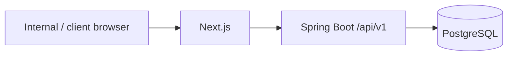

# Client Onboarding & Relationship Management Platform

A multi-tenant B2B onboarding system built as a **Spring Boot modular monolith** with a Next.js frontend and PostgreSQL as the source of truth.

The current `main` branch is implemented through **Phase 3**: identity and tenancy, client/project core, and the versioned workflow engine.

> This is not a microservices demo. That is deliberate.

## Why the architecture looks like this

Client onboarding gets messy when identity, project setup, workflow definitions and audit history are allowed to blur together.

I kept one deployable backend, but made the module boundaries explicit. That gives the codebase one transaction boundary and one source of truth without turning every domain boundary into a network call.



Redis and Kafka are intentionally absent at this stage. The current workload does not justify adding distributed infrastructure just to make the architecture diagram look more complicated.

## What is on `main`

### Phase 1 — identity and tenancy
- users, organizations and memberships
- server-side sessions
- RBAC and permission checks
- TOTP MFA and recovery codes
- internal employee invitations
- security audit records

### Phase 2 — client and project core
- clients and contacts
- service catalog
- projects and project members
- lifecycle transitions
- archive behavior
- activity history

### Phase 3 — workflow engine
- workflow templates and numbered versions
- draft/publish lifecycle
- ordered steps
- dependency graphs
- safe conditions
- immutable onboarding snapshots
- materialized step instances
- progress and readiness rules
- idempotent onboarding start

## The workflow decision I did not want to get wrong

A workflow template can change tomorrow. An onboarding process that already started should not silently change with it.

Published workflow versions are therefore immutable. Starting onboarding stores both an exact JSON snapshot and normalized step instances in one transaction.

Dependencies reject dangling, duplicate, self and cyclic edges. Conditions use a fixed field/operator/value model instead of executing tenant-authored scripts.

That adds more structure up front. It also makes historical onboarding explainable later.

Read the decision record: [ADR 0008 — versioned workflow snapshots](docs/adr/0008-versioned-workflow-snapshots.md).

## Technology

| Area | Stack |
|---|---|
| Backend | Java 17, Spring Boot 4.1, Spring Security, Spring Data JPA |
| Data | PostgreSQL 17, Flyway |
| Frontend | Next.js 16, React 19, TypeScript, Tailwind CSS 4 |
| Backend tests | JUnit, Spring Boot Test, ArchUnit, Testcontainers |
| Frontend tests | Vitest, React Testing Library, Playwright |
| Delivery | Docker Compose, GitHub Actions |

## Run locally

```bash
cp .env.example .env
```

Generate the MFA encryption key:

```bash
openssl rand -base64 32
```

For the first tenant only, enable the documented `APP_BOOTSTRAP_*` values. Disable bootstrap after it succeeds.

Then run:

```bash
docker compose up --build
```

- Frontend: `http://localhost:3000`
- Readiness: `http://localhost:8080/health/ready`
- Swagger UI: `http://localhost:8080/swagger-ui.html`

## Verification

Backend:

```bash
cd backend
./mvnw verify
```

Frontend:

```bash
cd frontend
npm ci
npm run lint
npm run typecheck
npm test -- --run
npm run build
npx playwright install --with-deps chromium
npm run test:e2e
```

Full Phase 3 gate:

```bash
./scripts/verify-phase-3.sh
```

The reviewed Phase 3 branch passed backend, frontend, PostgreSQL/Chromium and production-container gates in [GitHub Actions run 35592880143](https://github.com/JetyChodipilli/Client-Onboarding/actions/runs/35592880143).

## Repository map

```text
backend/              Spring Boot modular monolith
frontend/             Next.js application
design-system/        UI/UX source of truth
docs/adr/             Architecture decisions
docs/architecture/    Boundaries, conventions, threat model
docs/openapi/         Static API contract
docs/phase-reports/   Phase verification evidence
infrastructure/       Container foundations
scripts/              Reproducible verification gates
.github/workflows/    CI pipeline
```

## Current boundary

Phase 4 client invitations and client portal behavior are **not on `main` yet**.

That boundary is intentional. I would rather keep the repository honest about what is implemented than describe roadmap work as finished.

Architecture notes: [docs/architecture/README.md](docs/architecture/README.md)
