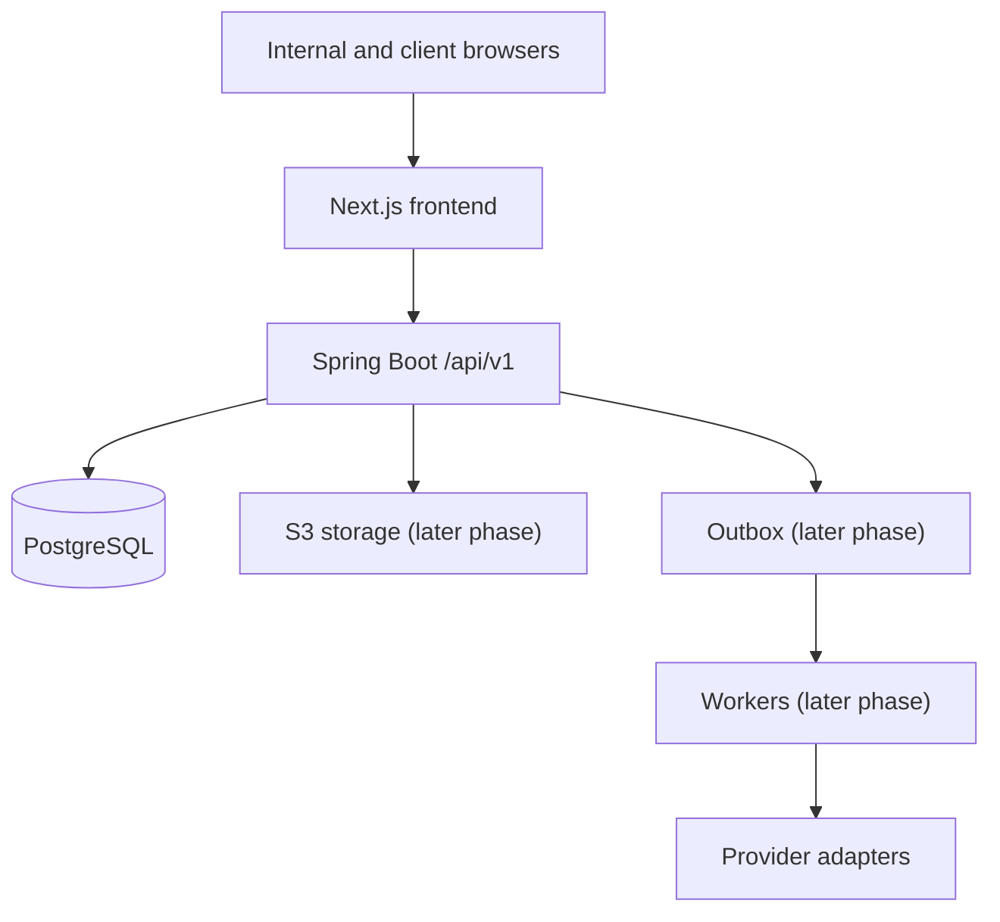

# Architecture Overview

## Target MVP system shape

The MVP is a modular monolith: one Spring Boot deployable, one PostgreSQL source of truth, one Next.js frontend and background workers executed from the same codebase. Module ownership is explicit so later extraction remains possible without accepting microservice complexity now.

Through Phase 3 the system includes identity, organization, RBAC, server-side sessions, security notifications,
MFA, audit persistence, tenant-owned client/project records, and the versioned workflow engine. Object storage
and business-provider adapters remain deferred. Redis is deliberately excluded; account lockout plus a bounded
per-node login limiter cover the current authentication surface, with distributed edge throttling required at
deployment.

## Trust boundaries

1. Browser input is untrusted.
2. The API authenticates the actor, resolves the organization context, checks permission, and validates resource relationships.
3. PostgreSQL is the system of record.
4. File bytes remain quarantined until validated and scanned.
5. Provider callbacks remain untrusted until their signatures and event identifiers are verified.
6. Background delivery never changes authoritative business state outside a transactionally recorded command/event path.

## Observability baseline

- Every HTTP response includes `X-Request-ID` and `X-Correlation-ID`.
- Inbound valid IDs are propagated; invalid/untrusted values are replaced.
- Both IDs are placed in MDC and structured ECS logs.
- Liveness is process-level; readiness verifies PostgreSQL.
- Actuator exposes bounded health/metrics information only.

## Implemented scope through Phase 3

- Phase 1 owns users, organizations, memberships, roles, permissions, security tokens, sessions, TOTP MFA,
  recovery codes, internal employee invitations, and security audit records.
- Phase 2 owns clients, contacts, services, projects, project members, lifecycle, archive behavior, and activity.
- Phase 3 owns versioned workflow templates, safe conditions, dependency graphs, onboarding snapshots, step
  instances, state validation, progress, and readiness.

Phase 4 client invitations and portal behavior are absent. An onboarding instance is created in `DRAFT`; later
phase lifecycle transitions are not simulated in Phase 3.
