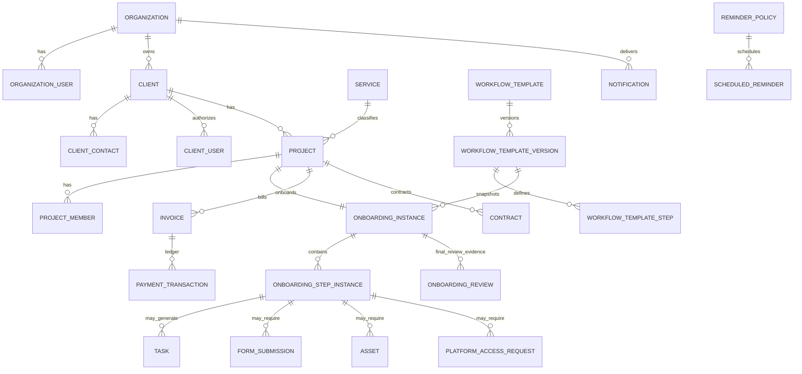

# Conceptual Domain Model Through Phase 11

## Important ownership rules

- Client, contact and client-auth identity remain separate.
- One project belongs to one tenant/client/service while a client may own many projects.
- Onboarding belongs to a project; it is not a client status.
- Workflow instances snapshot a published definition so later edits cannot mutate an active onboarding.
- Forms, assets, platform access, billing and contracts own their records; workflow only owns requirement state/snapshot orchestration.
- Payment, contract, project, onboarding and step states are not aliases for one another.
- Review decisions are append-only evidence.
- Final approval completes onboarding and advances project to READY; activation is separately authorized.
