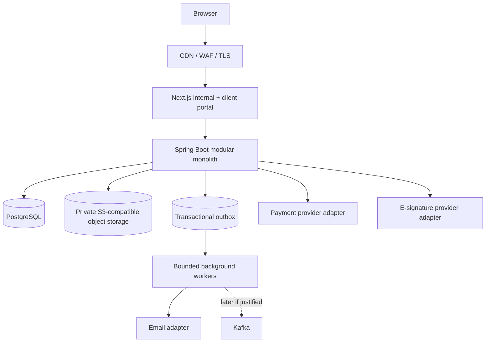

# System Architecture

The product remains a modular monolith; the phase sequence has not introduced microservices or Kafka.



PostgreSQL remains authoritative for domain state, outbox events, worker receipts and append-oriented audit/review evidence. Provider failures are isolated from the business transaction and remain recoverable/inspectable.

## Vertical slices through Phase 11

Foundation → identity/tenancy → client/project → workflow/onboarding → client portal → forms → assets → billing/payments → contracts → platform access → tasks/notifications/reminders → readiness/final review/project activation.

`reporting` remains reserved for Phase 12.

## Readiness/activation sequence

```text
Feature-owned requirement completes
  -> workflow step transition
  -> recompute blocking readiness
  -> AWAITING_INTERNAL_REVIEW when eligible
  -> human final review
       -> revision OR approval
  -> approval completes onboarding
  -> controlled Project boundary marks READY
  -> separate PROJECT_ACTIVATE command
  -> ACTIVE
```
